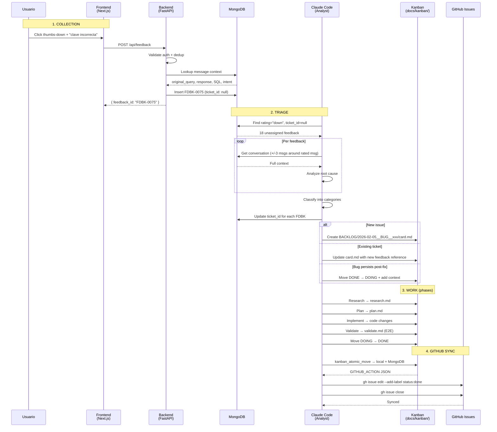
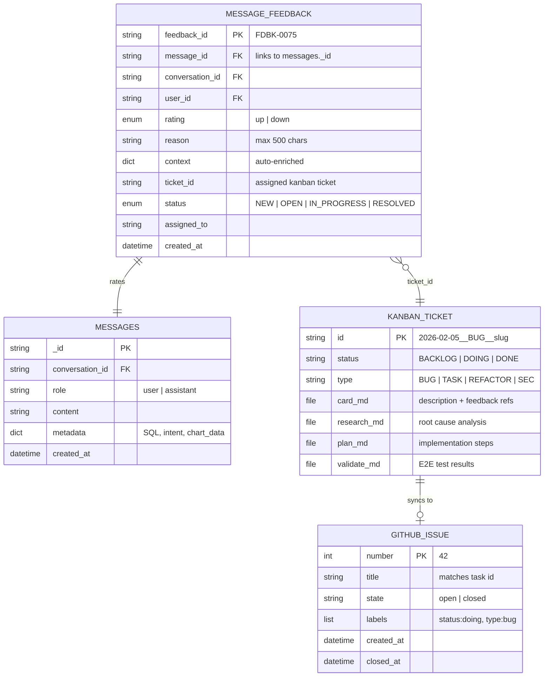
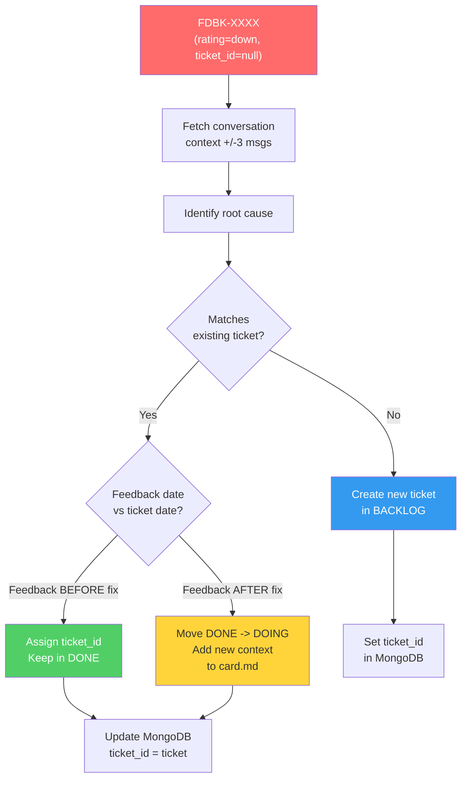

# Feedback Lifecycle: Collection → Triage → Resolution → GitHub Issues

## Overview Diagram

```mermaid
flowchart TB
    subgraph COLLECTION["1. COLLECTION (Real-time)"]
        direction TB
        U[("Usuario\n(bankadvisor.spativa.com)")] -->|"thumbs down/up\n+ razon opcional"| FE
        FE["MessageFeedback.tsx\n(React component)"] -->|"POST /api/feedback\n{message_id, rating, reason}"| API
        API["feedback.py router\n(FastAPI)"] -->|"auth + dedup\n+ rate limit 60/min"| SVC
        SVC["FeedbackService\n(context enrichment)"] -->|"auto-enrich:\n- original query\n- SQL executed\n- intent + confidence\n- chart data"| DB
        DB[("MongoDB\nmessage_feedback\nFDBK-0001..N")]
    end

    subgraph TRIAGE["2. TRIAGE (Claude Code session)"]
        direction TB
        QUERY["Query MongoDB\nticket_id = null\nrating = 'down'"] --> FETCH
        FETCH["Fetch full conversation\nper feedback_id\n(context window +/-3 msgs)"] --> ANALYZE
        ANALYZE["Analyze root cause:\n- What did user ask?\n- What did system answer?\n- Why is it wrong?"] --> CLASSIFY
        CLASSIFY{"Classify"}
        CLASSIFY -->|"matches existing\nticket"| ASSIGN
        CLASSIFY -->|"new issue\nnot seen before"| CREATE
        CLASSIFY -->|"feedback post-fix\nbug persists"| REOPEN
        ASSIGN["Assign ticket_id\nin MongoDB"]
        CREATE["Create new ticket\nin docs/kanban/BACKLOG/"]
        REOPEN["Move ticket\nDONE → DOING\n+ add new context"]
    end

    subgraph WORK["3. WORK (Kanban phases)"]
        direction LR
        BACKLOG["BACKLOG\n(prioritized)"] -->|"start"| DOING
        DOING["DOING"] --> R["Research\nresearch.md"]
        R --> P["Plan\nplan.md"]
        P --> I["Implement\n(code changes)"]
        I --> V["Validate\nvalidate.md\n(E2E tests)"]
        V -->|"tests pass"| DONE["DONE"]
        V -->|"tests fail"| I
    end

    subgraph DEPLOY["4. DEPLOY"]
        direction TB
        BUILD["docker build\nbank-advisor:v1.4.X"] --> PUSH["docker push\nto Docker Hub"]
        PUSH --> MANIFEST["Update\ndocker-compose.images.yml"]
        MANIFEST --> GIT["git commit + push"]
        GIT --> SSH["SSH to prod\njf@PROD_SERVER_IP"]
        SSH --> PULL["git pull +\ndocker pull"]
        PULL --> UP["docker compose up\n+ redis flush"]
    end

    subgraph SYNC["5. GITHUB SYNC (gh CLI)"]
        direction TB
        ATOMIC["kanban_atomic_move\n(MCP tool)"] -->|"GITHUB_ACTION\nJSON block"| GH_CLI
        GH_CLI["gh issue edit\n+ gh issue close"] -->|"labels:\nstatus:backlog/doing/review/done"| GITHUB
        GITHUB[("GitHub Issues\nsaptiva-ai/octavios-chat-bajaware_invex")]
    end

    DB -->|"analyst queries\nunassigned feedback"| QUERY
    ASSIGN --> WORK
    CREATE --> WORK
    REOPEN --> WORK
    DONE --> DEPLOY
    DONE -->|"kanban_atomic_move"| ATOMIC
    CREATE -->|"kanban_atomic_move"| ATOMIC
    REOPEN -->|"kanban_atomic_move"| ATOMIC
```



## Sequence Diagram (detailed data flow)



## Data Model



## Component Map

```
+-----------------------------------------------------------------+
|                        FRONTEND (Next.js)                        |
|                                                                  |
|  MessageFeedback.tsx --> useOptimizedChat.ts --> api-client.ts    |
|  (UI: thumbs up/down + textarea)  (hook)     (POST /api/feedback)|
+------------------------------+-----------------------------------+
                               | HTTP
+------------------------------v-----------------------------------+
|                        BACKEND (FastAPI)                          |
|                                                                  |
|  routers/feedback.py --> services/feedback_service.py            |
|  (auth, dedup, rate-limit)   (context enrichment, FDBK-ID gen)  |
+------------------------------+-----------------------------------+
                               |
+------------------------------v-----------------------------------+
|                     MONGODB (message_feedback)                    |
|                                                                  |
|  Indexes: message_id, conversation_id, user_id, feedback_id,    |
|           status, created_at, (composite: status+created_at)     |
+------------------------------+-----------------------------------+
                               | Query: ticket_id=null, rating=down
+------------------------------v-----------------------------------+
|                   TRIAGE (Claude Code session)                    |
|                                                                  |
|  1. Query unassigned feedback                                    |
|  2. Fetch +/-3 msgs around rated message                         |
|  3. Analyze root cause per conversation                          |
|  4. Classify -> assign/create/reopen                             |
|  5. Update MongoDB ticket_id                                     |
+------+------------------+------------------+---------------------+
       |                  |                  |
       v                  v                  v
+--------------+  +--------------+  +------------------+
| Assign to    |  | Create new   |  | Reopen ticket    |
| existing     |  | BACKLOG/     |  | DONE -> DOING    |
| ticket       |  | card.md      |  | + new context    |
+--------------+  +------+-------+  +--------+---------+
                         |                   |
+------------------------v-------------------v---------------------+
|                    KANBAN (docs/kanban/)                          |
|                                                                  |
|  BACKLOG/ --> DOING/ --> DONE/                                   |
|               |                                                  |
|               +-- Research (research.md)                         |
|               +-- Plan (plan.md)                                 |
|               +-- Implement (code)                               |
|               +-- Validate (validate.md + E2E)                   |
+------------------------+-----------------------------------------+
                         | kanban_atomic_move (local + MongoDB)
+------------------------v-----------------------------------------+
|              GITHUB_ACTION (JSON in MCP response)                 |
|                                                                  |
|  { action: "update_issue_status", repo: "...",                   |
|    add_label: "status:done", close_issue: true }                 |
+------------------------+-----------------------------------------+
                         | Claude Code executes via gh CLI
+------------------------v-----------------------------------------+
|                     GITHUB ISSUES                                 |
|                                                                  |
|  Labels: status:backlog | status:doing | status:done             |
|  State: open (active) | closed (done)                            |
+------------------------------------------------------------------+
```

## Triage Decision Tree


