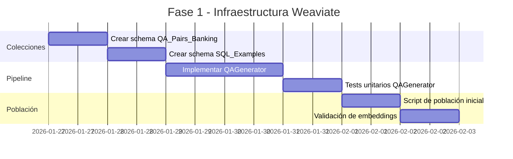
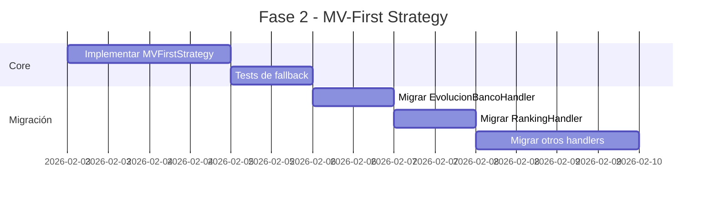
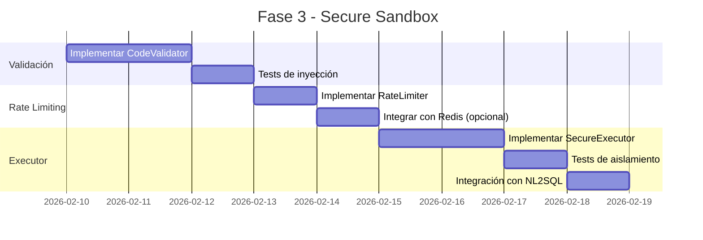
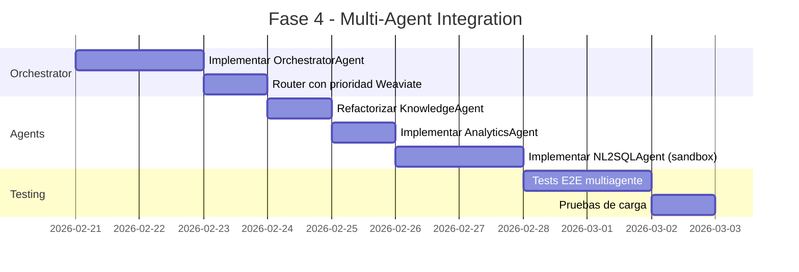
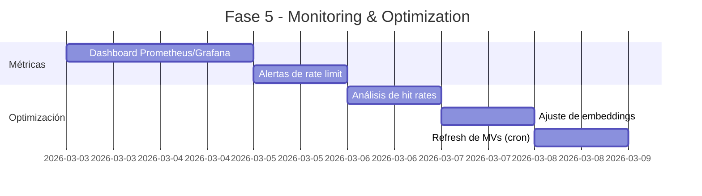

# Plan de Evolución Multiagente BankAdvisor

> **Objetivo**: Diseñar una arquitectura multiagente segura donde los agentes respondan consultas desde vistas materializadas (MVs) como fuente primaria, con fallback a la base completa, utilizando búsqueda vectorial en Weaviate para acceso proactivo al conocimiento.

---

## 1. Análisis del Estado Actual

### 1.1 Arquitectura Existente

```
┌─────────────────────────────────────────────────────────────────────────┐
│                          ESTADO ACTUAL                                   │
├─────────────────────────────────────────────────────────────────────────┤
│                                                                          │
│  User Query                                                              │
│       │                                                                  │
│       ▼                                                                  │
│  ┌─────────────────┐                                                    │
│  │ InputValidation │ ◄── 9 patrones de inyección SQL                   │
│  │    Stage        │                                                    │
│  └────────┬────────┘                                                    │
│           │                                                             │
│           ▼                                                             │
│  ┌─────────────────┐     ┌──────────────────────┐                      │
│  │ QueryRouter     │────►│ 15+ Handlers         │                      │
│  │ (Chain of Resp) │     │ - EvolucionBanco     │                      │
│  └─────────────────┘     │ - Ranking            │                      │
│           │              │ - CarteraRegion      │                      │
│           │              │ - Knowledge (Weaviate)│                     │
│           ▼              │ - etc.               │                      │
│  ┌─────────────────┐     └──────────────────────┘                      │
│  │ NL2SQL Agent    │                                                    │
│  │ (fallback)      │                                                    │
│  └─────────────────┘                                                    │
│                                                                          │
│  Datos:                                                                 │
│  - Weaviate: Solo ontología (Ontology_Term_V2)                         │
│  - PostgreSQL: 3NF + 11 MVs (sin estrategia de fallback)               │
│                                                                          │
└─────────────────────────────────────────────────────────────────────────┘
```

### 1.2 Commits Relevantes (últimos 35)

| Commit | Cambio Clave |
|--------|--------------|
| `bab0ee06` | Migración a tablas normalizadas y MVs |
| `52786c38` | Handlers basados en MV para analytics granular |
| `8da952e9` | Optimización MV `bank_mv_cartera_por_estado` |
| `d1e6636c` | Dashboard, MCP refactor, MV handlers |
| `06eb120e` | Fix de 16 vulnerabilidades de dependencias |

### 1.3 Brechas Identificadas

1. **Sin generación de Q&A**: No existe proceso para crear pares pregunta-respuesta
2. **Weaviate limitado**: Solo ontología, no Q&A ni ejemplos
3. **Sin fallback MV→DB**: Los handlers usan MVs directamente sin estrategia de fallback
4. **Sin sandbox de código**: Los agentes no ejecutan código dinámico
5. **Sin rate limiting**: No hay límites por agente/usuario

---

## 2. Arquitectura Propuesta

### 2.1 Diagrama de Alto Nivel

```
┌─────────────────────────────────────────────────────────────────────────────┐
│                        ARQUITECTURA MULTIAGENTE                              │
├─────────────────────────────────────────────────────────────────────────────┤
│                                                                              │
│  User Query                                                                  │
│       │                                                                      │
│       ▼                                                                      │
│  ┌──────────────────────────────────────────────────────────────────────┐   │
│  │                    ORCHESTRATOR AGENT                                 │   │
│  │  ┌─────────────┐ ┌─────────────┐ ┌─────────────┐ ┌─────────────┐    │   │
│  │  │ Validation  │ │ Intent      │ │ Router      │ │ RateLimiter │    │   │
│  │  │ Agent       │ │ Agent       │ │ Agent       │ │             │    │   │
│  │  └─────────────┘ └─────────────┘ └─────────────┘ └─────────────┘    │   │
│  └──────────────────────────────────────────────────────────────────────┘   │
│                              │                                               │
│              ┌───────────────┼───────────────┐                              │
│              ▼               ▼               ▼                              │
│  ┌───────────────┐ ┌───────────────┐ ┌───────────────┐                     │
│  │  KNOWLEDGE    │ │  ANALYTICS    │ │  NL2SQL       │                     │
│  │  AGENT        │ │  AGENT        │ │  AGENT        │                     │
│  │               │ │               │ │               │                     │
│  │ ┌───────────┐ │ │ ┌───────────┐ │ │ ┌───────────┐ │                     │
│  │ │ Weaviate  │ │ │ │ MV-First  │ │ │ │ Sandbox   │ │                     │
│  │ │ Q&A Search│ │ │ │ Strategy  │ │ │ │ Executor  │ │                     │
│  │ └───────────┘ │ │ └───────────┘ │ │ └───────────┘ │                     │
│  └───────────────┘ └───────────────┘ └───────────────┘                     │
│         │                  │                  │                             │
│         ▼                  ▼                  ▼                             │
│  ┌──────────────────────────────────────────────────────────────────────┐  │
│  │                      DATA LAYER                                       │  │
│  │                                                                       │  │
│  │   ┌─────────────────────────────────────────────────────────────┐    │  │
│  │   │  WEAVIATE                                                    │    │  │
│  │   │  ┌─────────────┐  ┌─────────────┐  ┌─────────────┐          │    │  │
│  │   │  │ Ontology    │  │ QA_Pairs    │  │ SQL_Examples│          │    │  │
│  │   │  │ _Term_V2    │  │ _Banking    │  │             │          │    │  │
│  │   │  └─────────────┘  └─────────────┘  └─────────────┘          │    │  │
│  │   └─────────────────────────────────────────────────────────────┘    │  │
│  │                                                                       │  │
│  │   ┌─────────────────────────────────────────────────────────────┐    │  │
│  │   │  POSTGRESQL                                                  │    │  │
│  │   │  ┌─────────────┐  ┌─────────────┐  ┌─────────────┐          │    │  │
│  │   │  │ MVs (11)    │  │ Fact Tables │  │ Dim Tables  │          │    │  │
│  │   │  │ [FAST PATH] │  │ [FALLBACK]  │  │             │          │    │  │
│  │   │  └─────────────┘  └─────────────┘  └─────────────┘          │    │  │
│  │   └─────────────────────────────────────────────────────────────┘    │  │
│  └──────────────────────────────────────────────────────────────────────┘  │
│                                                                              │
└──────────────────────────────────────────────────────────────────────────────┘
```

### 2.2 Colecciones Weaviate

#### 2.2.1 Nueva Colección: `QA_Pairs_Banking`

```json
{
  "class": "QA_Pairs_Banking",
  "description": "Question-answer pairs for banking analytics",
  "vectorizer": "text2vec-transformers",
  "moduleConfig": {
    "text2vec-transformers": {
      "model": "paraphrase-multilingual-MiniLM-L12-v2"
    }
  },
  "properties": [
    {
      "name": "question",
      "dataType": ["text"],
      "description": "Natural language question in Spanish",
      "moduleConfig": {
        "text2vec-transformers": {
          "skip": false,
          "vectorizePropertyName": false
        }
      }
    },
    {
      "name": "answer",
      "dataType": ["text"],
      "description": "Answer text with data context"
    },
    {
      "name": "sql_query",
      "dataType": ["text"],
      "description": "SQL query that generates the answer"
    },
    {
      "name": "source_type",
      "dataType": ["text"],
      "description": "mv | fact | aggregated"
    },
    {
      "name": "source_table",
      "dataType": ["text"],
      "description": "Table/MV name used"
    },
    {
      "name": "intent",
      "dataType": ["text"],
      "description": "ranking | evolution | comparison | knowledge | etc"
    },
    {
      "name": "metrics",
      "dataType": ["text[]"],
      "description": "Metrics involved (IMOR, ICAP, etc.)"
    },
    {
      "name": "banks",
      "dataType": ["text[]"],
      "description": "Banks mentioned (INVEX, BBVA, SISTEMA)"
    },
    {
      "name": "time_range",
      "dataType": ["text"],
      "description": "Time context (last_12_months, 2024, etc.)"
    },
    {
      "name": "confidence",
      "dataType": ["number"],
      "description": "Answer confidence score [0.0-1.0]"
    },
    {
      "name": "created_at",
      "dataType": ["date"],
      "description": "Timestamp of Q&A generation"
    },
    {
      "name": "data_date",
      "dataType": ["date"],
      "description": "Most recent data point date"
    }
  ]
}
```

#### 2.2.2 Nueva Colección: `SQL_Examples`

```json
{
  "class": "SQL_Examples",
  "description": "SQL query examples for NL2SQL training",
  "properties": [
    {
      "name": "natural_query",
      "dataType": ["text"],
      "description": "Natural language description"
    },
    {
      "name": "sql_template",
      "dataType": ["text"],
      "description": "Parameterized SQL template"
    },
    {
      "name": "tables_used",
      "dataType": ["text[]"],
      "description": "Tables involved"
    },
    {
      "name": "complexity",
      "dataType": ["text"],
      "description": "simple | medium | complex"
    },
    {
      "name": "validated",
      "dataType": ["boolean"],
      "description": "Human-validated flag"
    }
  ]
}
```

---

## 3. Proceso de Generación de Q&A

### 3.1 Pipeline de Generación

```
┌─────────────────────────────────────────────────────────────────────────────┐
│                    Q&A GENERATION PIPELINE                                   │
├─────────────────────────────────────────────────────────────────────────────┤
│                                                                              │
│  ┌────────────────┐     ┌────────────────┐     ┌────────────────┐          │
│  │ 1. TEMPLATE    │────►│ 2. SQL         │────►│ 3. DATA        │          │
│  │    EXPANSION   │     │    EXECUTION   │     │    EXTRACTION  │          │
│  └────────────────┘     └────────────────┘     └────────────────┘          │
│         │                      │                      │                     │
│         │                      │                      │                     │
│         ▼                      ▼                      ▼                     │
│  ┌────────────────┐     ┌────────────────┐     ┌────────────────┐          │
│  │ Q Templates:   │     │ Validated SQL  │     │ Raw Data:      │          │
│  │ - Rankings     │     │ (SqlValidator) │     │ - Charts       │          │
│  │ - Evolution    │     │                │     │ - Tables       │          │
│  │ - Comparison   │     │                │     │ - Stats        │          │
│  └────────────────┘     └────────────────┘     └────────────────┘          │
│                                                        │                     │
│                                                        ▼                     │
│  ┌────────────────┐     ┌────────────────┐     ┌────────────────┐          │
│  │ 6. WEAVIATE    │◄────│ 5. EMBEDDING   │◄────│ 4. ANSWER      │          │
│  │    UPLOAD      │     │    GENERATION  │     │    SYNTHESIS   │          │
│  └────────────────┘     └────────────────┘     └────────────────┘          │
│                                                                              │
└─────────────────────────────────────────────────────────────────────────────┘
```

### 3.2 Templates de Preguntas

```python
# plugins/bank-advisor-private/src/bankadvisor/qa_generation/templates.py

QA_TEMPLATES = {
    # Ranking Questions
    "ranking": [
        "¿Cuál es el ranking de {metric} del sistema bancario?",
        "¿Quién tiene el mayor {metric}?",
        "Top {n} bancos por {metric}",
        "¿Qué banco lidera en {metric}?",
        "¿Cuál es la posición de {bank} en {metric}?",
    ],

    # Evolution Questions
    "evolution": [
        "¿Cómo ha evolucionado {metric} de {bank}?",
        "Tendencia de {metric} últimos {n} meses",
        "Crecimiento YoY de {metric} de {bank}",
        "¿Cuánto creció {metric} este año?",
        "Variación mensual de {metric}",
    ],

    # Comparison Questions
    "comparison": [
        "{metric} de {bank1} vs {bank2}",
        "Comparar {metric} entre {bank1} y {bank2}",
        "¿Quién tiene mejor {metric}, {bank1} o {bank2}?",
        "Diferencia de {metric} entre {bank1} y SISTEMA",
    ],

    # Knowledge Questions (from Weaviate Ontology)
    "knowledge": [
        "¿Qué es {term}?",
        "Define {term}",
        "¿Cómo se calcula {term}?",
        "¿Cuál es la fórmula de {term}?",
    ],

    # Segmented Cartera Questions
    "cartera_segment": [
        "Cartera por {segment_type} de {bank}",
        "Distribución de cartera por {segment_type}",
        "¿Cuánto tiene {bank} en cartera {segment}?",
    ],
}

# Expansion parameters
BANKS = ["INVEX", "BBVA", "BANORTE", "SANTANDER", "HSBC", "CITIBANAMEX", "SISTEMA"]
METRICS = ["IMOR", "ICAP", "ICOR", "TDA", "ROE", "ROA", "CARTERA_TOTAL", "PDM"]
SEGMENTS = ["COMERCIAL", "CONSUMO", "VIVIENDA", "GOBIERNO"]
TIME_RANGES = [3, 6, 12, 24]  # months
```

### 3.3 Script de Generación

```python
# plugins/bank-advisor-private/src/bankadvisor/qa_generation/generator.py

"""
Q&A Generation Script for Weaviate Population

Usage:
    python -m bankadvisor.qa_generation.generator \
        --source mv \
        --output qa_pairs.json \
        --limit 1000
"""

import asyncio
import json
from datetime import datetime, date
from typing import List, Dict, Any, Optional
from itertools import product
import structlog

from bankadvisor.qa_generation.templates import QA_TEMPLATES, BANKS, METRICS
from bankadvisor.services.sql_validator import SqlValidator
from bankadvisor.db import get_async_session

logger = structlog.get_logger(__name__)


class QAGenerator:
    """
    Generates Q&A pairs from both MVs and full database.

    Strategy:
    1. Expand templates with parameter combinations
    2. Execute SQL against MV first, fallback to fact table
    3. Synthesize natural language answer
    4. Store with source metadata
    """

    MV_MAPPING = {
        "ranking": "bank_mv_ranking_cartera_mensual",
        "evolution": "bank_mv_evolucion_cartera_banco",
        "comparison": "bank_mv_comparativa_bancos",
        "cartera_segment": "bank_mv_cartera_por_actividad",
        "financial": "bank_mv_metricas_financieras",
        "sistema": "bank_mv_resumen_sistema",
    }

    FACT_FALLBACK = {
        "ranking": "bank_fact_kpis_mensual",
        "evolution": "bank_fact_kpis_mensual",
        "comparison": "bank_fact_kpis_mensual",
        "cartera_segment": "bank_fact_cartera_segmentada",
        "financial": "bank_fact_metricas_financieras",
    }

    def __init__(self):
        self.validator = SqlValidator()
        self.qa_pairs: List[Dict[str, Any]] = []

    async def generate_all(
        self,
        source: str = "mv",  # "mv" | "fact" | "both"
        limit: int = 1000,
    ) -> List[Dict[str, Any]]:
        """Generate Q&A pairs from specified source."""

        async with get_async_session() as session:
            # Generate ranking Q&As
            await self._generate_ranking_qas(session, source)

            # Generate evolution Q&As
            await self._generate_evolution_qas(session, source)

            # Generate comparison Q&As
            await self._generate_comparison_qas(session, source)

            # Limit results
            return self.qa_pairs[:limit]

    async def _generate_ranking_qas(
        self,
        session,
        source: str,
    ):
        """Generate ranking Q&A pairs."""
        for metric in METRICS:
            for template in QA_TEMPLATES["ranking"]:
                question = template.format(
                    metric=metric,
                    n=10,
                    bank="INVEX",
                )

                # Try MV first
                table = self.MV_MAPPING["ranking"] if source in ("mv", "both") else self.FACT_FALLBACK["ranking"]

                sql = self._build_ranking_sql(metric, table)
                validation = self.validator.validate(sql)

                if not validation.valid:
                    logger.warning("qa_gen.invalid_sql", sql=sql[:100])
                    continue

                try:
                    result = await session.execute(text(validation.sanitized_sql))
                    rows = result.fetchall()

                    if rows:
                        answer = self._synthesize_ranking_answer(metric, rows)
                        self.qa_pairs.append({
                            "question": question,
                            "answer": answer,
                            "sql_query": validation.sanitized_sql,
                            "source_type": "mv" if "mv" in table else "fact",
                            "source_table": table,
                            "intent": "ranking",
                            "metrics": [metric],
                            "banks": [r[0] for r in rows[:5]],
                            "time_range": "latest",
                            "confidence": 0.95,
                            "created_at": datetime.utcnow().isoformat(),
                            "data_date": str(rows[0][1]) if len(rows[0]) > 1 else None,
                        })
                except Exception as e:
                    logger.error("qa_gen.execution_error", error=str(e))

                    # Fallback to fact table
                    if source == "both" and "mv" in table:
                        fallback_table = self.FACT_FALLBACK["ranking"]
                        await self._try_fallback(
                            session, question, metric, fallback_table, "ranking"
                        )

    def _build_ranking_sql(self, metric: str, table: str) -> str:
        """Build validated ranking SQL."""
        metric_col = metric.lower()
        return f"""
            SELECT
                banco_norm,
                fecha,
                {metric_col}
            FROM {table}
            WHERE {metric_col} IS NOT NULL
            ORDER BY {metric_col} DESC
            LIMIT 10
        """

    def _synthesize_ranking_answer(
        self,
        metric: str,
        rows: List,
    ) -> str:
        """Synthesize natural language answer for ranking."""
        if not rows:
            return f"No hay datos disponibles para {metric}."

        leader = rows[0]
        answer = f"El banco con mayor {metric} es {leader[0]} "
        if len(leader) > 2 and leader[2] is not None:
            answer += f"con un valor de {leader[2]:.2f}%. "

        if len(rows) > 1:
            second = rows[1]
            answer += f"En segundo lugar está {second[0]}."

        return answer


def main():
    """CLI entry point."""
    import argparse

    parser = argparse.ArgumentParser(description="Generate Q&A pairs for Weaviate")
    parser.add_argument("--source", choices=["mv", "fact", "both"], default="both")
    parser.add_argument("--output", default="qa_pairs.json")
    parser.add_argument("--limit", type=int, default=1000)

    args = parser.parse_args()

    generator = QAGenerator()
    qa_pairs = asyncio.run(generator.generate_all(
        source=args.source,
        limit=args.limit,
    ))

    with open(args.output, "w", encoding="utf-8") as f:
        json.dump(qa_pairs, f, ensure_ascii=False, indent=2)

    print(f"Generated {len(qa_pairs)} Q&A pairs → {args.output}")


if __name__ == "__main__":
    main()
```

---

## 4. Estrategia MV-First con Fallback

### 4.1 Patrón de Acceso a Datos

```python
# plugins/bank-advisor-private/src/bankadvisor/data_access/mv_first_strategy.py

"""
MV-First Data Access Strategy

Pattern:
1. Try Materialized View (fast, pre-aggregated)
2. If MV unavailable/empty → Fallback to Fact Table
3. Log performance metrics for optimization
"""

from typing import Optional, List, Dict, Any, Tuple
from enum import Enum
import time
import structlog
from sqlalchemy import text
from sqlalchemy.ext.asyncio import AsyncSession

logger = structlog.get_logger(__name__)


class DataSource(str, Enum):
    MV = "materialized_view"
    FACT = "fact_table"
    CACHE = "weaviate_cache"


class MVFirstStrategy:
    """
    Implements MV-first data access with automatic fallback.

    Architecture:
        Query → Weaviate (Q&A cache) → MV → Fact Table

    Benefits:
        - Sub-second response from MVs
        - Full flexibility from fact tables
        - Q&A cache for common questions
    """

    # MV to Fact Table mapping
    FALLBACK_MAP: Dict[str, str] = {
        "bank_mv_evolucion_cartera_banco": "bank_fact_kpis_mensual",
        "bank_mv_metricas_financieras": "bank_fact_metricas_financieras",
        "bank_mv_resumen_sistema": "bank_fact_kpis_mensual",
        "bank_mv_ranking_cartera_mensual": "bank_fact_kpis_mensual",
        "bank_mv_comparativa_bancos": "bank_fact_kpis_mensual",
        "bank_mv_cartera_por_actividad": "bank_fact_cartera_segmentada",
        "bank_mv_cartera_por_tamano": "bank_fact_cartera_segmentada",
        "bank_mv_cartera_por_destino": "bank_fact_cartera_segmentada",
        "bank_mv_cartera_por_estado": "bank_fact_cartera_segmentada",
        "bank_mv_vivienda_por_perfil": "bank_fact_cartera_segmentada",
        "bank_mv_vivienda_por_producto": "bank_fact_cartera_segmentada",
    }

    def __init__(self, session: AsyncSession):
        self.session = session
        self._metrics: List[Dict[str, Any]] = []

    async def query(
        self,
        mv_name: str,
        sql_template: str,
        params: Dict[str, Any],
        timeout_ms: int = 5000,
    ) -> Tuple[List[Any], DataSource, float]:
        """
        Execute query with MV-first strategy.

        Args:
            mv_name: Target materialized view name
            sql_template: SQL template with {table} placeholder
            params: Query parameters
            timeout_ms: Timeout in milliseconds

        Returns:
            Tuple of (results, data_source, execution_time_ms)
        """
        start = time.perf_counter()

        # Step 1: Try MV
        try:
            sql = sql_template.format(table=mv_name)
            result = await asyncio.wait_for(
                self.session.execute(text(sql), params),
                timeout=timeout_ms / 1000,
            )
            rows = result.fetchall()

            if rows:
                elapsed = (time.perf_counter() - start) * 1000
                self._log_metric(mv_name, DataSource.MV, elapsed, len(rows))
                return rows, DataSource.MV, elapsed

        except asyncio.TimeoutError:
            logger.warning("mv_first.timeout", mv=mv_name, timeout_ms=timeout_ms)
        except Exception as e:
            logger.warning("mv_first.mv_error", mv=mv_name, error=str(e))

        # Step 2: Fallback to Fact Table
        fallback_table = self.FALLBACK_MAP.get(mv_name)
        if not fallback_table:
            logger.error("mv_first.no_fallback", mv=mv_name)
            return [], DataSource.MV, 0

        try:
            sql = sql_template.format(table=fallback_table)
            result = await self.session.execute(text(sql), params)
            rows = result.fetchall()

            elapsed = (time.perf_counter() - start) * 1000
            self._log_metric(fallback_table, DataSource.FACT, elapsed, len(rows))
            return rows, DataSource.FACT, elapsed

        except Exception as e:
            logger.error("mv_first.fact_error", table=fallback_table, error=str(e))
            return [], DataSource.FACT, 0

    def _log_metric(
        self,
        table: str,
        source: DataSource,
        elapsed_ms: float,
        row_count: int,
    ):
        """Log performance metric for monitoring."""
        metric = {
            "table": table,
            "source": source.value,
            "elapsed_ms": elapsed_ms,
            "row_count": row_count,
            "timestamp": datetime.utcnow().isoformat(),
        }
        self._metrics.append(metric)

        logger.info(
            "mv_first.query_complete",
            table=table,
            source=source.value,
            elapsed_ms=f"{elapsed_ms:.2f}",
            rows=row_count,
        )

    def get_performance_report(self) -> Dict[str, Any]:
        """Get performance summary for optimization."""
        if not self._metrics:
            return {"total_queries": 0}

        mv_queries = [m for m in self._metrics if m["source"] == DataSource.MV.value]
        fact_queries = [m for m in self._metrics if m["source"] == DataSource.FACT.value]

        return {
            "total_queries": len(self._metrics),
            "mv_queries": len(mv_queries),
            "fact_fallbacks": len(fact_queries),
            "mv_hit_rate": len(mv_queries) / len(self._metrics) if self._metrics else 0,
            "avg_mv_time_ms": sum(m["elapsed_ms"] for m in mv_queries) / len(mv_queries) if mv_queries else 0,
            "avg_fact_time_ms": sum(m["elapsed_ms"] for m in fact_queries) / len(fact_queries) if fact_queries else 0,
        }
```

### 4.2 Integración con Handlers

```python
# Ejemplo: Modificar EvolucionBancoHandler para usar MVFirstStrategy

async def _get_bank_evolution(
    self,
    session: Any,
    bank: str,
    period_type: str,
) -> Dict[str, Any]:
    """Get evolution data using MV-First strategy."""
    from bankadvisor.data_access.mv_first_strategy import MVFirstStrategy

    strategy = MVFirstStrategy(session)

    growth_col = "crecimiento_yoy_pct" if period_type == "yoy" else "crecimiento_mom_pct"

    sql_template = """
        SELECT
            periodo_id,
            fecha,
            cartera_total,
            {growth_col} as crecimiento,
            imor
        FROM {{table}}
        WHERE LOWER(banco) = LOWER(:bank)
        ORDER BY periodo_id DESC
        LIMIT 12
    """.format(growth_col=growth_col)

    rows, source, elapsed = await strategy.query(
        mv_name="bank_mv_evolucion_cartera_banco",
        sql_template=sql_template,
        params={"bank": bank},
    )

    # Add source metadata to response
    response = self._format_response(rows)
    response["metadata"] = {
        "data_source": source.value,
        "query_time_ms": elapsed,
    }

    return response
```

---

## 5. Contenedor Seguro para Ejecución de Código

### 5.1 Arquitectura del Sandbox

```
┌─────────────────────────────────────────────────────────────────────────────┐
│                        SECURE EXECUTION SANDBOX                              │
├─────────────────────────────────────────────────────────────────────────────┤
│                                                                              │
│  ┌────────────────────────────────────────────────────────────────────────┐ │
│  │                         SECURITY LAYERS                                 │ │
│  │  ┌────────────┐  ┌────────────┐  ┌────────────┐  ┌────────────┐       │ │
│  │  │ 1. INPUT   │  │ 2. SYNTAX  │  │ 3. AST     │  │ 4. RUNTIME │       │ │
│  │  │ VALIDATION │─►│ ANALYSIS   │─►│ INSPECTION │─►│ ISOLATION  │       │ │
│  │  └────────────┘  └────────────┘  └────────────┘  └────────────┘       │ │
│  └────────────────────────────────────────────────────────────────────────┘ │
│                                                                              │
│  ┌────────────────────────────────────────────────────────────────────────┐ │
│  │                         RATE LIMITING                                   │ │
│  │  ┌────────────┐  ┌────────────┐  ┌────────────┐                        │ │
│  │  │ Per-User   │  │ Per-Agent  │  │ Global     │                        │ │
│  │  │ 100 req/m  │  │ 500 req/m  │  │ 10k req/m  │                        │ │
│  │  └────────────┘  └────────────┘  └────────────┘                        │ │
│  └────────────────────────────────────────────────────────────────────────┘ │
│                                                                              │
│  ┌────────────────────────────────────────────────────────────────────────┐ │
│  │                    EXECUTION ENVIRONMENT                                │ │
│  │  ┌──────────────────────────────────────────────────────────────────┐  │ │
│  │  │  RESTRICTED BUILTINS                                              │  │ │
│  │  │  - No: exec, eval, compile, __import__, open, input              │  │ │
│  │  │  - Yes: len, str, int, float, list, dict, sum, min, max, sorted  │  │ │
│  │  └──────────────────────────────────────────────────────────────────┘  │ │
│  │  ┌──────────────────────────────────────────────────────────────────┐  │ │
│  │  │  ALLOWED MODULES (whitelist)                                      │  │ │
│  │  │  - pandas (data manipulation)                                     │  │ │
│  │  │  - numpy (numerical operations)                                   │  │ │
│  │  │  - datetime (time operations)                                     │  │ │
│  │  │  - math (mathematical functions)                                  │  │ │
│  │  │  - statistics (statistical functions)                             │  │ │
│  │  └──────────────────────────────────────────────────────────────────┘  │ │
│  │  ┌──────────────────────────────────────────────────────────────────┐  │ │
│  │  │  RESOURCE LIMITS                                                  │  │ │
│  │  │  - Max execution time: 30 seconds                                 │  │ │
│  │  │  - Max memory: 256MB                                              │  │ │
│  │  │  - Max output size: 10MB                                          │  │ │
│  │  │  - No network access                                              │  │ │
│  │  │  - No filesystem access                                           │  │ │
│  │  └──────────────────────────────────────────────────────────────────┘  │ │
│  └────────────────────────────────────────────────────────────────────────┘ │
│                                                                              │
└──────────────────────────────────────────────────────────────────────────────┘
```

### 5.2 Implementación del Sandbox

```python
# plugins/bank-advisor-private/src/bankadvisor/sandbox/secure_executor.py

"""
Secure Code Execution Sandbox

Provides isolated Python execution with:
- Input validation (syntax + AST analysis)
- Restricted builtins
- Module whitelist
- Resource limits (time, memory)
- Rate limiting
"""

import ast
import sys
import time
import resource
import signal
from typing import Any, Dict, List, Optional, Set
from dataclasses import dataclass
from contextlib import contextmanager
import structlog

logger = structlog.get_logger(__name__)


@dataclass
class ExecutionResult:
    """Result of sandbox code execution."""
    success: bool
    output: Any
    error: Optional[str] = None
    execution_time_ms: float = 0
    memory_used_mb: float = 0


@dataclass
class ExecutionConfig:
    """Sandbox configuration."""
    max_execution_time_s: int = 30
    max_memory_mb: int = 256
    max_output_size_bytes: int = 10 * 1024 * 1024  # 10MB
    allowed_modules: Set[str] = None

    def __post_init__(self):
        if self.allowed_modules is None:
            self.allowed_modules = {
                "pandas", "numpy", "datetime", "math", "statistics",
                "collections", "itertools", "functools", "decimal",
            }


class CodeValidator:
    """
    Validates code before execution using AST analysis.

    Detects and blocks:
    - Import of forbidden modules
    - Dangerous function calls (exec, eval, compile)
    - File system access (open, Path)
    - Network access (socket, urllib, requests)
    - System calls (os.system, subprocess)
    """

    FORBIDDEN_NAMES: Set[str] = {
        # Dangerous builtins
        "exec", "eval", "compile", "__import__", "open",
        "input", "breakpoint", "help", "exit", "quit",
        # File system
        "Path", "pathlib", "shutil",
        # Network
        "socket", "urllib", "requests", "httpx", "aiohttp",
        # System
        "subprocess", "os", "sys", "importlib",
        # Code manipulation
        "code", "codeop", "dis", "inspect",
    }

    FORBIDDEN_ATTRIBUTES: Set[str] = {
        "__class__", "__bases__", "__subclasses__", "__mro__",
        "__code__", "__globals__", "__builtins__",
        "__dict__", "__module__", "__import__",
    }

    def validate(self, code: str) -> tuple[bool, Optional[str]]:
        """
        Validate code for security issues.

        Returns:
            Tuple of (is_valid, error_message)
        """
        # Step 1: Syntax check
        try:
            tree = ast.parse(code)
        except SyntaxError as e:
            return False, f"Syntax error: {e}"

        # Step 2: AST analysis
        for node in ast.walk(tree):
            # Check imports
            if isinstance(node, ast.Import):
                for alias in node.names:
                    if alias.name.split(".")[0] in self.FORBIDDEN_NAMES:
                        return False, f"Forbidden import: {alias.name}"

            if isinstance(node, ast.ImportFrom):
                if node.module and node.module.split(".")[0] in self.FORBIDDEN_NAMES:
                    return False, f"Forbidden import: {node.module}"

            # Check function calls
            if isinstance(node, ast.Call):
                if isinstance(node.func, ast.Name):
                    if node.func.id in self.FORBIDDEN_NAMES:
                        return False, f"Forbidden function: {node.func.id}"

                if isinstance(node.func, ast.Attribute):
                    if node.func.attr in self.FORBIDDEN_NAMES:
                        return False, f"Forbidden method: {node.func.attr}"

            # Check attribute access
            if isinstance(node, ast.Attribute):
                if node.attr in self.FORBIDDEN_ATTRIBUTES:
                    return False, f"Forbidden attribute: {node.attr}"

        return True, None


class RateLimiter:
    """
    Token bucket rate limiter for execution requests.

    Levels:
    - Per-user: 100 requests/minute
    - Per-agent: 500 requests/minute
    - Global: 10,000 requests/minute
    """

    def __init__(self):
        self._buckets: Dict[str, Dict[str, Any]] = {}

    def check_limit(
        self,
        user_id: str,
        agent_id: str,
    ) -> tuple[bool, Optional[str]]:
        """
        Check if request is within rate limits.

        Returns:
            Tuple of (is_allowed, error_message)
        """
        now = time.time()

        # Per-user limit
        user_key = f"user:{user_id}"
        if not self._check_bucket(user_key, now, max_tokens=100, refill_rate=100/60):
            return False, f"User rate limit exceeded (100 req/min)"

        # Per-agent limit
        agent_key = f"agent:{agent_id}"
        if not self._check_bucket(agent_key, now, max_tokens=500, refill_rate=500/60):
            return False, f"Agent rate limit exceeded (500 req/min)"

        # Global limit
        if not self._check_bucket("global", now, max_tokens=10000, refill_rate=10000/60):
            return False, "Global rate limit exceeded (10k req/min)"

        return True, None

    def _check_bucket(
        self,
        key: str,
        now: float,
        max_tokens: int,
        refill_rate: float,
    ) -> bool:
        """Check and update token bucket."""
        if key not in self._buckets:
            self._buckets[key] = {"tokens": max_tokens, "last_refill": now}

        bucket = self._buckets[key]

        # Refill tokens based on time elapsed
        elapsed = now - bucket["last_refill"]
        bucket["tokens"] = min(max_tokens, bucket["tokens"] + elapsed * refill_rate)
        bucket["last_refill"] = now

        # Check if we have tokens
        if bucket["tokens"] >= 1:
            bucket["tokens"] -= 1
            return True

        return False


class SecureExecutor:
    """
    Secure Python code executor with sandboxing.

    Features:
    - Input validation (syntax + AST)
    - Restricted builtins
    - Module whitelist
    - Resource limits
    - Rate limiting
    """

    SAFE_BUILTINS: Dict[str, Any] = {
        # Type constructors
        "bool": bool, "int": int, "float": float, "str": str,
        "list": list, "dict": dict, "set": set, "tuple": tuple,
        "frozenset": frozenset, "bytes": bytes, "bytearray": bytearray,

        # Functions
        "len": len, "range": range, "enumerate": enumerate,
        "zip": zip, "map": map, "filter": filter,
        "sum": sum, "min": max, "max": max,
        "abs": abs, "round": round, "pow": pow,
        "sorted": sorted, "reversed": reversed,
        "any": any, "all": all,
        "isinstance": isinstance, "issubclass": issubclass,
        "hasattr": hasattr, "getattr": getattr, "setattr": setattr,
        "repr": repr, "hash": hash, "id": id,
        "print": print,  # Captured to output

        # Type checking
        "type": type,

        # Constants
        "True": True, "False": False, "None": None,
    }

    def __init__(self, config: ExecutionConfig = None):
        self.config = config or ExecutionConfig()
        self.validator = CodeValidator()
        self.rate_limiter = RateLimiter()

    def execute(
        self,
        code: str,
        user_id: str,
        agent_id: str,
        context: Dict[str, Any] = None,
    ) -> ExecutionResult:
        """
        Execute code in sandbox.

        Args:
            code: Python code to execute
            user_id: User identifier for rate limiting
            agent_id: Agent identifier for rate limiting
            context: Variables to inject into execution context

        Returns:
            ExecutionResult with output or error
        """
        start_time = time.perf_counter()

        # Step 1: Rate limit check
        allowed, error = self.rate_limiter.check_limit(user_id, agent_id)
        if not allowed:
            return ExecutionResult(
                success=False,
                output=None,
                error=error,
            )

        # Step 2: Code validation
        valid, error = self.validator.validate(code)
        if not valid:
            logger.warning("sandbox.validation_failed", error=error, code=code[:100])
            return ExecutionResult(
                success=False,
                output=None,
                error=f"Validation failed: {error}",
            )

        # Step 3: Build restricted environment
        restricted_globals = self._build_restricted_globals(context)

        # Step 4: Execute with resource limits
        try:
            output = self._execute_with_limits(code, restricted_globals)

            elapsed = (time.perf_counter() - start_time) * 1000
            logger.info(
                "sandbox.execution_success",
                elapsed_ms=f"{elapsed:.2f}",
                user_id=user_id,
                agent_id=agent_id,
            )

            return ExecutionResult(
                success=True,
                output=output,
                execution_time_ms=elapsed,
            )

        except TimeoutError:
            return ExecutionResult(
                success=False,
                output=None,
                error=f"Execution timeout ({self.config.max_execution_time_s}s)",
            )
        except MemoryError:
            return ExecutionResult(
                success=False,
                output=None,
                error=f"Memory limit exceeded ({self.config.max_memory_mb}MB)",
            )
        except Exception as e:
            logger.error("sandbox.execution_error", error=str(e))
            return ExecutionResult(
                success=False,
                output=None,
                error=f"Execution error: {str(e)}",
            )

    def _build_restricted_globals(
        self,
        context: Dict[str, Any] = None,
    ) -> Dict[str, Any]:
        """Build restricted globals for execution."""
        import pandas as pd
        import numpy as np
        import datetime
        import math
        import statistics

        globals_dict = {
            "__builtins__": self.SAFE_BUILTINS,
            # Allowed modules (read-only)
            "pd": pd,
            "np": np,
            "datetime": datetime,
            "math": math,
            "statistics": statistics,
        }

        # Add context variables
        if context:
            for key, value in context.items():
                if not key.startswith("_"):  # No private variables
                    globals_dict[key] = value

        return globals_dict

    def _execute_with_limits(
        self,
        code: str,
        globals_dict: Dict[str, Any],
    ) -> Any:
        """Execute code with resource limits."""
        # Set memory limit
        soft, hard = resource.getrlimit(resource.RLIMIT_AS)
        resource.setrlimit(
            resource.RLIMIT_AS,
            (self.config.max_memory_mb * 1024 * 1024, hard)
        )

        # Set timeout
        def timeout_handler(signum, frame):
            raise TimeoutError("Execution timeout")

        signal.signal(signal.SIGALRM, timeout_handler)
        signal.alarm(self.config.max_execution_time_s)

        try:
            # Capture output
            output_capture: List[str] = []

            def safe_print(*args, **kwargs):
                output_capture.append(" ".join(str(a) for a in args))

            globals_dict["__builtins__"]["print"] = safe_print

            # Execute
            local_vars: Dict[str, Any] = {}
            exec(compile(code, "<sandbox>", "exec"), globals_dict, local_vars)

            # Return result or captured output
            if "result" in local_vars:
                return local_vars["result"]
            elif output_capture:
                return "\n".join(output_capture)
            else:
                return local_vars

        finally:
            signal.alarm(0)  # Cancel timeout
            resource.setrlimit(resource.RLIMIT_AS, (soft, hard))  # Reset memory limit
```

---

## 6. Plan de Implementación por Fases

### Fase 1: Infraestructura Weaviate (1 semana)

**Objetivo**: Crear colecciones y pipeline de población



**Entregables**:
- `src/bankadvisor/qa_generation/` - Módulo de generación
- `scripts/populate_weaviate_qa.py` - Script de población
- `tests/unit/test_qa_generator.py` - Tests

### Fase 2: Estrategia MV-First (1 semana)

**Objetivo**: Implementar patrón de acceso con fallback



**Entregables**:
- `src/bankadvisor/data_access/mv_first_strategy.py`
- Handlers migrados con metadata de source
- Métricas de performance

### Fase 3: Sandbox Seguro (1.5 semanas)

**Objetivo**: Contenedor de ejecución con validación y rate limiting



**Entregables**:
- `src/bankadvisor/sandbox/` - Módulo completo
- Tests de seguridad (injection, memory, timeout)
- Documentación de límites

### Fase 4: Integración Multiagente (1.5 semanas)

**Objetivo**: Orquestar agentes con Weaviate como cache



**Entregables**:
- `src/bankadvisor/agents/orchestrator_agent.py`
- `src/bankadvisor/agents/analytics_agent.py`
- Tests E2E con escenarios multiagente

### Fase 5: Monitoreo y Optimización (1 semana)

**Objetivo**: Métricas, alertas, y ajustes de rendimiento



**Entregables**:
- Dashboard de métricas
- Alertas configuradas
- Proceso de refresh de Q&A

---

## 7. Estructura de Archivos Propuesta

```
plugins/bank-advisor-private/
├── src/bankadvisor/
│   ├── agents/
│   │   ├── __init__.py
│   │   ├── orchestrator_agent.py      # [NEW] Orquestador multiagente
│   │   ├── knowledge_agent.py         # [MODIFIED] Usa QA_Pairs
│   │   ├── analytics_agent.py         # [NEW] MV-First strategy
│   │   └── nl2sql_agent.py           # [MODIFIED] Sandbox integration
│   │
│   ├── data_access/
│   │   ├── __init__.py
│   │   └── mv_first_strategy.py       # [NEW] MV-First with fallback
│   │
│   ├── qa_generation/
│   │   ├── __init__.py
│   │   ├── templates.py               # [NEW] Q&A templates
│   │   ├── generator.py               # [NEW] Q&A generator
│   │   └── weaviate_uploader.py       # [NEW] Weaviate population
│   │
│   ├── sandbox/
│   │   ├── __init__.py
│   │   ├── code_validator.py          # [NEW] AST-based validation
│   │   ├── rate_limiter.py            # [NEW] Token bucket limiter
│   │   └── secure_executor.py         # [NEW] Sandboxed execution
│   │
│   └── services/
│       └── weaviate_qa_service.py     # [NEW] Q&A search service
│
├── schemas/
│   ├── weaviate_qa_pairs.json         # [NEW] QA_Pairs_Banking schema
│   └── weaviate_sql_examples.json     # [NEW] SQL_Examples schema
│
├── scripts/
│   ├── populate_weaviate_qa.py        # [NEW] Population script
│   └── refresh_qa_pairs.sh            # [NEW] Cron refresh script
│
└── tests/
    ├── unit/
    │   ├── test_qa_generator.py       # [NEW]
    │   ├── test_mv_first_strategy.py  # [NEW]
    │   ├── test_code_validator.py     # [NEW]
    │   └── test_rate_limiter.py       # [NEW]
    │
    └── integration/
        └── test_multiagent_e2e.py     # [NEW]
```

---

## 8. Checklist de Seguridad

### 8.1 Validación de Inputs

- [x] **SQL Injection**: 9 patrones en `InputValidationStage` (existente)
- [x] **SQL Validator**: 4 capas de defensa (existente)
- [ ] **Code Validator**: AST analysis (nuevo)
- [ ] **Parameter Sanitization**: Bound parameters en todas las queries

### 8.2 Rate Limiting

- [ ] Per-user: 100 req/min
- [ ] Per-agent: 500 req/min
- [ ] Global: 10k req/min
- [ ] Backoff exponencial en caso de límite

### 8.3 Sandbox Execution

- [ ] Builtins restringidos (sin exec/eval/open)
- [ ] Módulos en whitelist
- [ ] Timeout de 30s
- [ ] Límite de memoria 256MB
- [ ] Sin acceso a red/filesystem

### 8.4 Weaviate Security

- [ ] API key para producción
- [ ] Colecciones separadas por tenant (futuro)
- [ ] Validación de embeddings antes de upload

---

## 9. Métricas de Éxito

| Métrica | Baseline | Target |
|---------|----------|--------|
| Tiempo respuesta (P95) | ~2s | <500ms |
| MV hit rate | 0% | >80% |
| Q&A cache hit rate | 0% | >30% |
| Rate limit violations | - | <1% |
| Security incidents | - | 0 |

---

## 10. Riesgos y Mitigaciones

| Riesgo | Probabilidad | Impacto | Mitigación |
|--------|--------------|---------|------------|
| Embeddings desactualizados | Alta | Medio | Refresh semanal + monitoring |
| Fallback lento a fact tables | Media | Alto | Cache de queries frecuentes |
| Sandbox escape | Baja | Crítico | Tests de penetración, auditoría |
| Rate limit demasiado agresivo | Media | Medio | Métricas, ajuste dinámico |

---

## Apéndice A: Ejemplos de Q&A Generados

```json
[
  {
    "question": "¿Cuál es el ranking de IMOR del sistema bancario?",
    "answer": "El banco con mayor IMOR es BANCO AZTECA con 8.21%. En segundo lugar está COMPARTAMOS con 7.45%. INVEX se encuentra en posición 15 con 2.34%, por debajo del promedio del sistema (2.89%).",
    "sql_query": "SELECT banco_norm, imor FROM bank_mv_ranking_cartera_mensual ORDER BY imor DESC LIMIT 10",
    "source_type": "mv",
    "source_table": "bank_mv_ranking_cartera_mensual",
    "intent": "ranking",
    "metrics": ["IMOR"],
    "banks": ["BANCO AZTECA", "COMPARTAMOS", "INVEX"],
    "time_range": "latest",
    "confidence": 0.95,
    "created_at": "2026-01-26T12:00:00Z",
    "data_date": "2025-12-31"
  },
  {
    "question": "¿Cómo ha evolucionado el ICAP de INVEX?",
    "answer": "El ICAP de INVEX ha mostrado una tendencia estable en los últimos 12 meses, manteniéndose entre 15.2% y 16.1%. El valor actual es 15.8%, superior al mínimo regulatorio de 10.5%.",
    "sql_query": "SELECT fecha, icap FROM bank_mv_evolucion_cartera_banco WHERE LOWER(banco) = 'invex' ORDER BY periodo_id DESC LIMIT 12",
    "source_type": "mv",
    "source_table": "bank_mv_evolucion_cartera_banco",
    "intent": "evolution",
    "metrics": ["ICAP"],
    "banks": ["INVEX"],
    "time_range": "last_12_months",
    "confidence": 0.92,
    "created_at": "2026-01-26T12:00:00Z",
    "data_date": "2025-12-31"
  }
]
```

---

## Apéndice B: Configuración de Weaviate

```yaml
# docker-compose.weaviate.yml
services:
  weaviate:
    image: cr.weaviate.io/semitechnologies/weaviate:1.24.1
    ports:
      - "8080:8080"
    environment:
      QUERY_DEFAULTS_LIMIT: 25
      AUTHENTICATION_ANONYMOUS_ACCESS_ENABLED: 'false'
      AUTHENTICATION_APIKEY_ENABLED: 'true'
      AUTHENTICATION_APIKEY_ALLOWED_KEYS: '${WEAVIATE_API_KEY}'
      AUTHENTICATION_APIKEY_USERS: 'bank-advisor'
      PERSISTENCE_DATA_PATH: '/var/lib/weaviate'
      DEFAULT_VECTORIZER_MODULE: 'text2vec-transformers'
      ENABLE_MODULES: 'text2vec-transformers'
      TRANSFORMERS_INFERENCE_API: 'http://t2v-transformers:8080'
    volumes:
      - weaviate_data:/var/lib/weaviate
    depends_on:
      - t2v-transformers

  t2v-transformers:
    image: cr.weaviate.io/semitechnologies/transformers-inference:sentence-transformers-paraphrase-multilingual-MiniLM-L12-v2
    environment:
      ENABLE_CUDA: '0'
```
