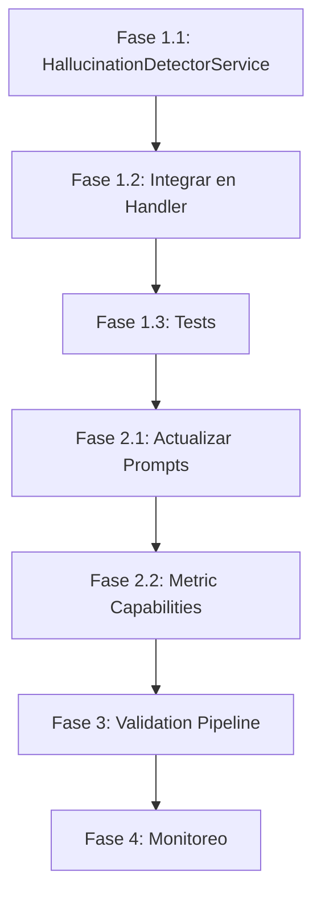

# Plan de Implementación: Detección de Alucinaciones

## Resumen de Fases

| Fase | Nombre | Duración | Impacto |
|------|--------|----------|---------|
| 1 | Validación Matemática | 2-3 días | Detecta 80% de errores obvios |
| 2 | Mejora de Prompts | 3-4 días | Previene 60% de alucinaciones |
| 3 | Validación Post-Respuesta | 1 semana | Detecta 95% de discrepancias |
| 4 | Monitoreo Continuo | Ongoing | Feedback loop de mejora |

---

## Fase 1: Validación Matemática (Quick Wins)

### 1.1 Crear `HallucinationDetectorService`

**Archivo:** `apps/backend/src/services/hallucination_detector.py`

```python
"""
Hallucination Detector Service.

Detecta posibles alucinaciones comparando respuestas del LLM
con datos de la fuente (bank-advisor).
"""

import re
from typing import List, Dict, Optional, Tuple
from dataclasses import dataclass
import structlog

logger = structlog.get_logger(__name__)


@dataclass
class HallucinationWarning:
    """Warning de posible alucinación detectada."""
    type: str  # "percentage_sum", "value_mismatch", "unsupported_breakdown"
    severity: str  # "high", "medium", "low"
    message: str
    expected: Optional[str] = None
    found: Optional[str] = None


class HallucinationDetectorService:
    """Servicio para detectar alucinaciones en respuestas del LLM."""

    # Patrones para extraer valores
    PERCENTAGE_PATTERN = r'(\d+(?:\.\d+)?)\s*%'
    MONETARY_PATTERN = r'\*?\*?(\d{1,3}(?:,\d{3})*(?:\.\d+)?)\s*(?:MDP|mdp|M\.D\.P\.)'

    # Tolerancias
    PERCENTAGE_SUM_TOLERANCE = 2.0  # ±2%
    VALUE_MATCH_TOLERANCE = 0.01  # 1%

    @classmethod
    def validate_response(
        cls,
        response_text: str,
        bank_chart_data: Optional[Dict] = None,
    ) -> List[HallucinationWarning]:
        """
        Valida una respuesta del LLM contra datos de la fuente.

        Args:
            response_text: Texto de respuesta del LLM
            bank_chart_data: Datos del bank-advisor (si disponibles)

        Returns:
            Lista de warnings de posibles alucinaciones
        """
        warnings = []

        # 1. Validar suma de porcentajes
        pct_warnings = cls._validate_percentage_sum(response_text)
        warnings.extend(pct_warnings)

        # 2. Validar valores contra fuente
        if bank_chart_data:
            value_warnings = cls._validate_values_against_source(
                response_text, bank_chart_data
            )
            warnings.extend(value_warnings)

        # 3. Detectar desgloses no soportados
        breakdown_warnings = cls._detect_unsupported_breakdowns(
            response_text, bank_chart_data
        )
        warnings.extend(breakdown_warnings)

        if warnings:
            logger.warning(
                "hallucination_detector.warnings_found",
                warning_count=len(warnings),
                types=[w.type for w in warnings],
            )

        return warnings

    @classmethod
    def _validate_percentage_sum(cls, text: str) -> List[HallucinationWarning]:
        """Detecta si hay porcentajes que no suman ~100%."""
        warnings = []

        # Buscar tablas o listas con porcentajes
        percentages = re.findall(cls.PERCENTAGE_PATTERN, text)
        percentages = [float(p) for p in percentages]

        if len(percentages) >= 3:  # Al menos 3 items para considerar una lista
            total = sum(percentages)

            # Si hay un "100%" explícito, ignorarlo del cálculo
            if 100.0 in percentages:
                percentages_without_total = [p for p in percentages if p != 100.0]
                total = sum(percentages_without_total)

            if abs(total - 100.0) > cls.PERCENTAGE_SUM_TOLERANCE:
                warnings.append(HallucinationWarning(
                    type="percentage_sum",
                    severity="high",
                    message=f"Porcentajes suman {total:.1f}%, no 100%",
                    expected="100.0%",
                    found=f"{total:.1f}%"
                ))

        return warnings

    @classmethod
    def _validate_values_against_source(
        cls,
        text: str,
        bank_chart_data: Dict
    ) -> List[HallucinationWarning]:
        """Verifica que valores monetarios coincidan con la fuente."""
        warnings = []

        # Extraer valores de la fuente
        source_values = cls._extract_source_values(bank_chart_data)
        if not source_values:
            return warnings

        # Extraer valores del texto
        text_values = cls._extract_monetary_values(text)

        for text_val in text_values:
            # Verificar si el valor está en la fuente (con tolerancia)
            if not cls._value_in_source(text_val, source_values):
                # Verificar si es una suma/derivación válida
                if not cls._is_valid_derivation(text_val, source_values):
                    warnings.append(HallucinationWarning(
                        type="value_mismatch",
                        severity="high",
                        message=f"Valor {text_val:,.0f} no encontrado en datos de origen",
                        expected=f"Valores disponibles: {source_values[:5]}...",
                        found=str(text_val)
                    ))

        return warnings

    @classmethod
    def _detect_unsupported_breakdowns(
        cls,
        text: str,
        bank_chart_data: Optional[Dict]
    ) -> List[HallucinationWarning]:
        """Detecta si se mencionan desgloses que no están en los datos."""
        warnings = []

        # Patrones que indican desglose regional
        regional_patterns = [
            r'regi[oó]n\s+(centro|norte|sur|occidente|sureste)',
            r'por\s+entidad\s+federativa',
            r'por\s+estado',
            r'desglose\s+geogr[aá]fico',
        ]

        has_regional_mention = any(
            re.search(pattern, text, re.IGNORECASE)
            for pattern in regional_patterns
        )

        if has_regional_mention:
            # Verificar si los datos de origen tienen desglose regional
            has_regional_data = cls._source_has_regional_data(bank_chart_data)

            if not has_regional_data:
                warnings.append(HallucinationWarning(
                    type="unsupported_breakdown",
                    severity="high",
                    message="Respuesta menciona desglose regional pero datos son solo temporales",
                    expected="Datos temporales (serie mensual)",
                    found="Mención de regiones geográficas"
                ))

        return warnings

    @classmethod
    def _extract_source_values(cls, bank_chart_data: Dict) -> List[float]:
        """Extrae valores numéricos de los datos del bank-advisor."""
        values = []

        try:
            plotly_config = bank_chart_data.get("plotly_config", {})
            traces = plotly_config.get("data", [])

            for trace in traces:
                y_values = trace.get("y", [])
                values.extend([float(v) for v in y_values if v is not None])
        except Exception as e:
            logger.warning("Failed to extract source values", error=str(e))

        return values

    @classmethod
    def _extract_monetary_values(cls, text: str) -> List[float]:
        """Extrae valores monetarios del texto."""
        matches = re.findall(cls.MONETARY_PATTERN, text)
        values = []

        for match in matches:
            try:
                # Remover comas y convertir
                clean_val = match.replace(",", "")
                values.append(float(clean_val))
            except ValueError:
                pass

        return values

    @classmethod
    def _value_in_source(cls, value: float, source_values: List[float]) -> bool:
        """Verifica si un valor está en la fuente (con tolerancia)."""
        for source_val in source_values:
            if source_val == 0:
                continue
            diff_pct = abs(value - source_val) / source_val
            if diff_pct <= cls.VALUE_MATCH_TOLERANCE:
                return True
        return False

    @classmethod
    def _is_valid_derivation(cls, value: float, source_values: List[float]) -> bool:
        """Verifica si el valor es una derivación válida (suma, promedio, etc.)."""
        if not source_values:
            return False

        # Verificar si es la suma total
        total = sum(source_values)
        if abs(value - total) / total <= cls.VALUE_MATCH_TOLERANCE:
            return True

        # Verificar si es el promedio
        avg = total / len(source_values)
        if abs(value - avg) / avg <= cls.VALUE_MATCH_TOLERANCE:
            return True

        return False

    @classmethod
    def _source_has_regional_data(cls, bank_chart_data: Optional[Dict]) -> bool:
        """Verifica si los datos de origen tienen desglose regional."""
        if not bank_chart_data:
            return False

        metadata = bank_chart_data.get("metadata", {})
        intent = metadata.get("intent", "")

        # Si el intent es "regional" o similar, tiene datos regionales
        if "region" in intent.lower():
            return True

        # Verificar si hay múltiples traces con nombres de regiones
        plotly_config = bank_chart_data.get("plotly_config", {})
        traces = plotly_config.get("data", [])

        region_keywords = ["centro", "norte", "sur", "occidente", "sureste", "oriente"]

        for trace in traces:
            name = trace.get("name", "").lower()
            if any(kw in name for kw in region_keywords):
                return True

        return False
```

### 1.2 Integrar en Streaming Handler

**Archivo:** `apps/backend/src/services/streaming/streaming_handler.py`

Agregar después de generar respuesta:

```python
from ..hallucination_detector import HallucinationDetectorService, HallucinationWarning

# En el método que procesa respuestas...
async def _process_response(self, response_text: str, metadata: dict):
    # Validar respuesta contra datos de origen
    bank_chart_data = metadata.get("bank_chart_data")

    warnings = HallucinationDetectorService.validate_response(
        response_text=response_text,
        bank_chart_data=bank_chart_data,
    )

    if warnings:
        # Log para análisis
        logger.warning(
            "hallucination.warnings_detected",
            warnings=[w.__dict__ for w in warnings],
            session_id=self.session_id,
            message_preview=response_text[:100],
        )

        # Opcional: Agregar disclaimer si hay warnings de alta severidad
        high_severity = [w for w in warnings if w.severity == "high"]
        if high_severity:
            # Agregar metadata para tracking
            metadata["hallucination_warnings"] = [w.__dict__ for w in warnings]
```

### 1.3 Tests Unitarios

**Archivo:** `apps/backend/tests/unit/test_hallucination_detector.py`

```python
import pytest
from src.services.hallucination_detector import (
    HallucinationDetectorService,
    HallucinationWarning,
)


class TestPercentageValidation:
    """Tests para validación de porcentajes."""

    def test_detects_percentages_over_100(self):
        """Debe detectar cuando porcentajes suman más de 100%."""
        text = """
        | Región | Participación |
        | Centro | 47.2% |
        | Norte | 27.3% |
        | Sur | 19.8% |
        | Oeste | 11.8% |
        | Este | 7.6% |
        """

        warnings = HallucinationDetectorService._validate_percentage_sum(text)

        assert len(warnings) == 1
        assert warnings[0].type == "percentage_sum"
        assert "113" in warnings[0].found  # 113.7%

    def test_allows_valid_percentages(self):
        """No debe generar warnings para porcentajes válidos."""
        text = """
        | Región | Participación |
        | Centro | 50% |
        | Norte | 30% |
        | Sur | 20% |
        """

        warnings = HallucinationDetectorService._validate_percentage_sum(text)

        assert len(warnings) == 0


class TestValueValidation:
    """Tests para validación de valores contra fuente."""

    def test_detects_value_not_in_source(self):
        """Debe detectar valores que no están en la fuente."""
        text = "El saldo es **18,646,463,515 MDP**"

        bank_chart_data = {
            "plotly_config": {
                "data": [{
                    "y": [16402586992]  # Valor real diferente
                }]
            }
        }

        warnings = HallucinationDetectorService._validate_values_against_source(
            text, bank_chart_data
        )

        assert len(warnings) == 1
        assert warnings[0].type == "value_mismatch"

    def test_allows_valid_values(self):
        """No debe generar warnings para valores que están en la fuente."""
        text = "El saldo es **16,402,586,992 MDP**"

        bank_chart_data = {
            "plotly_config": {
                "data": [{
                    "y": [16402586992]
                }]
            }
        }

        warnings = HallucinationDetectorService._validate_values_against_source(
            text, bank_chart_data
        )

        assert len(warnings) == 0


class TestBreakdownDetection:
    """Tests para detección de desgloses no soportados."""

    def test_detects_regional_mention_without_data(self):
        """Debe detectar mención de regiones sin datos regionales."""
        text = "La Región Centro tiene el 47% del total"

        bank_chart_data = {
            "metadata": {"intent": "evolution"},
            "plotly_config": {
                "data": [{"name": "INVEX", "y": [1, 2, 3]}]
            }
        }

        warnings = HallucinationDetectorService._detect_unsupported_breakdowns(
            text, bank_chart_data
        )

        assert len(warnings) == 1
        assert warnings[0].type == "unsupported_breakdown"
```

---

## Fase 2: Mejora de Prompts

### 2.1 System Prompt Actualizado

**Archivo:** Agregar a prompts del bank-advisor o streaming handler

```markdown
## REGLAS CRÍTICAS DE DATOS (OBLIGATORIO)

### Regla 1: Solo Datos de la Fuente
- ÚNICAMENTE menciona valores que aparecen en `bank_chart_data`
- NUNCA inventes números, porcentajes o desgloses
- Si calculas algo, muestra el cálculo explícitamente

### Regla 2: Admitir Limitaciones
Cuando el usuario pida datos que NO están disponibles:

❌ INCORRECTO:
"La distribución por región es: Centro 47%, Norte 30%..."
(Inventando datos que no existen)

✅ CORRECTO:
"Tengo disponible la evolución temporal de la cartera comercial,
pero actualmente no cuento con desglose por región geográfica.
¿Te gustaría ver los datos mensuales disponibles?"

### Regla 3: Validar Matemáticas
Antes de mostrar porcentajes:
1. Calcula cada porcentaje: (valor / total) × 100
2. Verifica que sumen 100% (±0.5% por redondeo)
3. Si no suman, revisa los cálculos

### Regla 4: Transparencia de Fuente
Al presentar datos, indica:
- "Según los datos del sistema bancario al [fecha]..."
- "De acuerdo con la información disponible..."
- NO uses frases como "datos verificados" para información inventada
```

### 2.2 Metadata de Capacidades por Métrica

**Archivo:** `apps/backend/src/config/metric_capabilities.py`

```python
"""
Configuración de capacidades disponibles por métrica.

Define qué tipos de desgloses están disponibles para cada métrica,
para que el LLM sepa qué puede y no puede responder.
"""

METRIC_CAPABILITIES = {
    "IMOR": {
        "available_breakdowns": ["temporal", "banco", "sector"],
        "supports_comparison": True,
        "supports_ranking": True,
    },
    "ICAP": {
        "available_breakdowns": ["temporal", "banco"],
        "supports_comparison": True,
        "supports_ranking": True,
    },
    "CARTERA_COMERCIAL": {
        "available_breakdowns": ["temporal", "banco"],
        "supports_comparison": True,
        "supports_ranking": True,
        "NOT_AVAILABLE": ["regional", "entidad_federativa", "sector"],
    },
    "ROE": {
        "available_breakdowns": ["temporal", "banco"],
        "supports_comparison": True,
        "supports_ranking": True,
    },
    # ... más métricas
}

def get_metric_capabilities(metric_name: str) -> dict:
    """Obtiene las capacidades de una métrica."""
    return METRIC_CAPABILITIES.get(
        metric_name.upper(),
        {"available_breakdowns": ["temporal"], "supports_comparison": False}
    )

def format_capabilities_for_prompt(metric_name: str) -> str:
    """Formatea las capacidades para incluir en el prompt del LLM."""
    caps = get_metric_capabilities(metric_name)

    available = caps.get("available_breakdowns", [])
    not_available = caps.get("NOT_AVAILABLE", [])

    text = f"Para {metric_name}:\n"
    text += f"- Desgloses disponibles: {', '.join(available)}\n"

    if not_available:
        text += f"- NO disponible: {', '.join(not_available)}\n"

    return text
```

---

## Fase 3: Validación Post-Respuesta

### 3.1 Pipeline de Validación

```python
class ResponseValidationPipeline:
    """Pipeline de validación de respuestas antes de enviar al usuario."""

    async def validate_and_fix(
        self,
        response: str,
        source_data: dict,
        user_query: str,
    ) -> Tuple[str, List[HallucinationWarning]]:
        """
        Valida respuesta y opcionalmente la corrige.

        Returns:
            Tuple de (respuesta_final, warnings)
        """
        warnings = HallucinationDetectorService.validate_response(
            response, source_data
        )

        high_severity = [w for w in warnings if w.severity == "high"]

        if not high_severity:
            return response, warnings

        # Intentar regenerar respuesta con prompt más estricto
        if self._should_regenerate(warnings):
            new_response = await self._regenerate_with_constraints(
                user_query, source_data, warnings
            )
            return new_response, warnings

        # Agregar disclaimer si no se puede regenerar
        disclaimer = self._generate_disclaimer(warnings)
        return response + "\n\n" + disclaimer, warnings

    def _should_regenerate(self, warnings: List[HallucinationWarning]) -> bool:
        """Decide si regenerar basado en tipo de warnings."""
        for w in warnings:
            if w.type == "unsupported_breakdown":
                return True  # Siempre regenerar si pidió algo no soportado
        return False

    async def _regenerate_with_constraints(
        self,
        query: str,
        source_data: dict,
        warnings: List[HallucinationWarning],
    ) -> str:
        """Regenera respuesta con constraints adicionales."""
        constraint_prompt = """
        IMPORTANTE: La respuesta anterior contenía datos no verificables.

        Restricciones para esta respuesta:
        1. SOLO usa estos valores de la fuente: {source_values}
        2. Si no hay datos para lo que pide el usuario, di "no disponible"
        3. NO inventes números ni porcentajes
        """

        # Regenerar con LLM...
        pass

    def _generate_disclaimer(self, warnings: List[HallucinationWarning]) -> str:
        """Genera disclaimer para agregar a respuesta."""
        return (
            "⚠️ *Nota: Algunos valores en esta respuesta pueden requerir "
            "verificación adicional con la fuente de datos oficial.*"
        )
```

---

## Fase 4: Monitoreo y Métricas

### 4.1 Schema de Logging

```python
# En cada respuesta validada, loggear:
logger.info(
    "response.validation_complete",
    session_id=session_id,
    message_id=message_id,
    user_id=user_id,
    metric_name=metric_name,
    query_type=query_type,  # "evolution", "comparison", "breakdown"

    # Métricas de validación
    warnings_count=len(warnings),
    warning_types=[w.type for w in warnings],
    has_percentage_error=any(w.type == "percentage_sum" for w in warnings),
    has_value_mismatch=any(w.type == "value_mismatch" for w in warnings),
    has_unsupported_breakdown=any(w.type == "unsupported_breakdown" for w in warnings),

    # Para correlacionar con feedback
    timestamp=datetime.utcnow().isoformat(),
)
```

### 4.2 Dashboard de Métricas

Métricas a trackear en Grafana/Datadog:

| Métrica | Query | Alerta |
|---------|-------|--------|
| `hallucination.rate` | warnings > 0 / total_responses | > 5% |
| `hallucination.percentage_errors` | type=percentage_sum / total | > 1% |
| `hallucination.value_mismatches` | type=value_mismatch / total | > 10% |
| `hallucination.by_metric` | Group by metric_name | Identificar métricas problemáticas |
| `feedback.negative_with_hallucination` | Correlación feedback + warnings | > 50% correlación |

---

## Dependencias y Orden de Ejecución



## Estimación de Esfuerzo

| Fase | Tarea | Estimación |
|------|-------|------------|
| 1.1 | HallucinationDetectorService | 4h |
| 1.2 | Integración en Handler | 2h |
| 1.3 | Tests unitarios | 3h |
| 2.1 | Actualizar prompts | 2h |
| 2.2 | Metric capabilities config | 2h |
| 3 | Validation pipeline | 6h |
| 4 | Logging y métricas | 4h |
| **Total** | | **~23h** |
