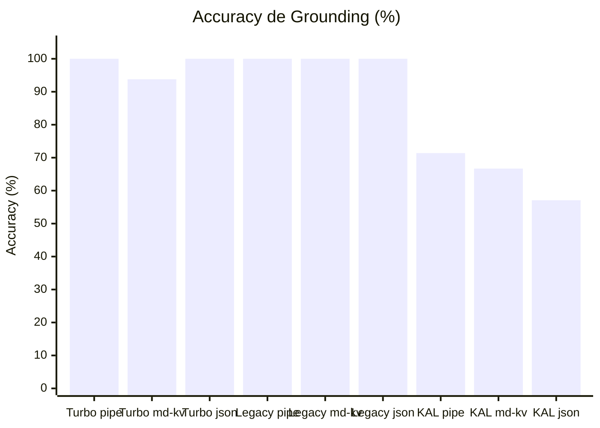
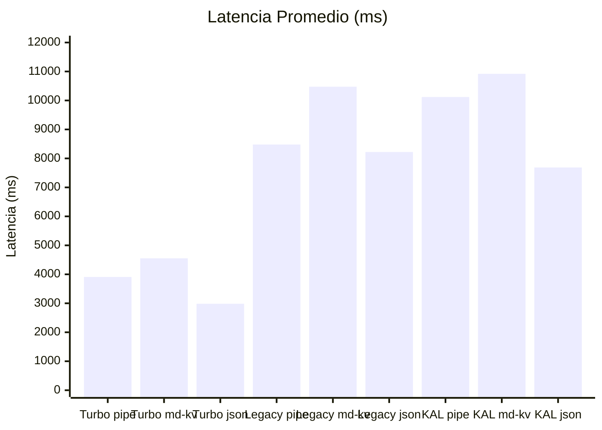
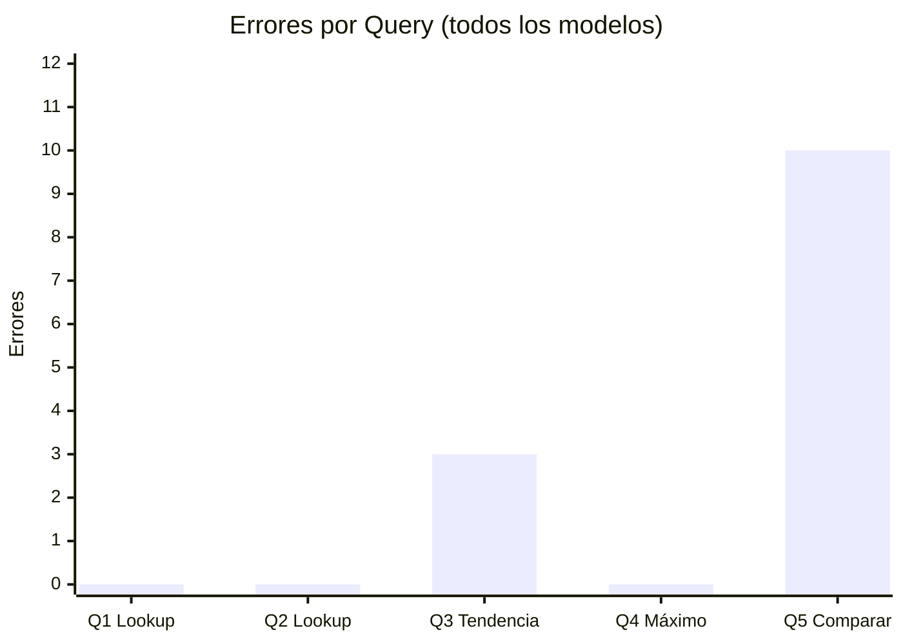
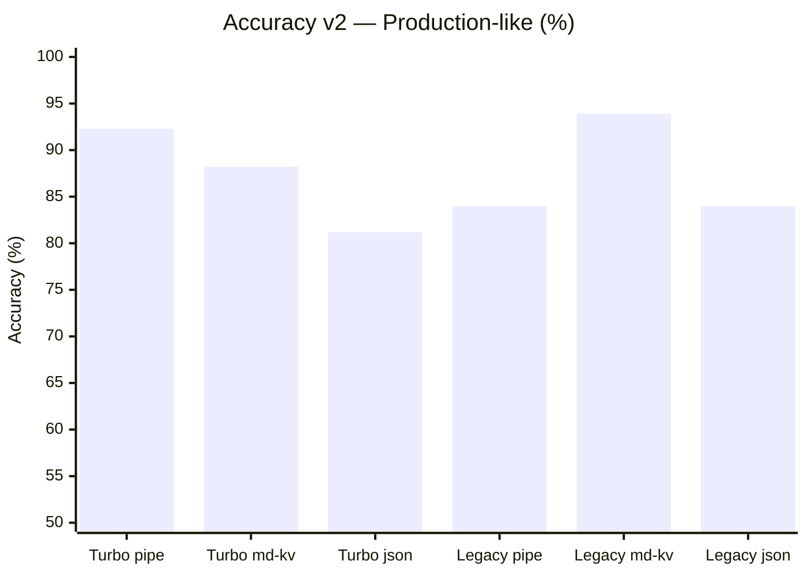
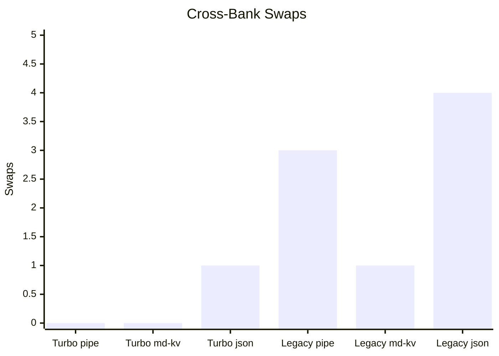
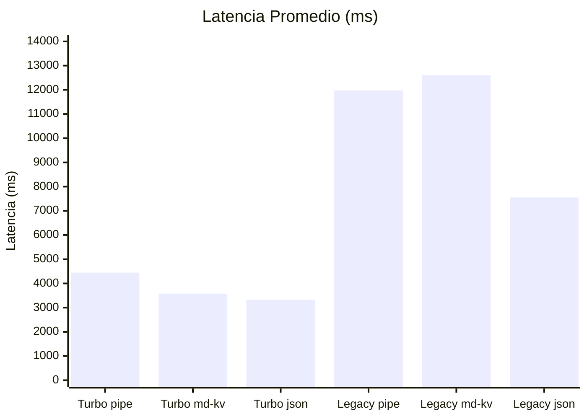

# Benchmark: Grounding Accuracy — Modelo x Formato

> Fecha: 2026-02-11 | Queries: 5 | Datos: 12 meses sintéticos (Cartera Comercial INVEX)

## Resumen Ejecutivo

Se evaluaron **3 modelos Saptiva** en **3 formatos de contexto** para medir la precisión con la que citan pares mes-valor de datos financieros inyectados en el system prompt. El objetivo: determinar si el bug `response-grounding-desync` (el LLM asocia valores correctos a meses incorrectos) se puede mitigar cambiando el formato de datos o el modelo.

### Hallazgo Principal

| Combinación | Accuracy | Latencia | Veredicto |
|-------------|----------|----------|-----------|
| **Turbo + pipe-table** | **100%** | **3.9s** | Producción actual ya es óptima en escenario simple |
| **Turbo + json-block** | **100%** | **3.0s** | Alternativa viable, menor latencia |
| **Legacy + cualquiera** | **100%** | **8-10s** | Perfecto pero 2.5x más lento |
| **KAL + cualquiera** | **57-71%** | **8-11s** | Descartado — errores graves de swap |

---

## Metodología

### Datos de prueba
- 12 puntos mensuales (Ene-Dic 2024) con valores deliberadamente distintos
- Rango: 10,483.55 — 20,147.82 MDP (sin valores similares que confundan)
- Stats pre-computados: último, mínimo, máximo, cambio período

### Modelos evaluados

| Modelo | Arquitectura | Params activos | Notas |
|--------|-------------|----------------|-------|
| **Saptiva Turbo** | Qwen 3:30B-A3B | ~3.3B | Modelo actual en producción |
| **Saptiva Legacy** | Llama 3.3:70B | 70B | Modelo más grande disponible |
| **Saptiva KAL** | Mistral Small 3.2:24B | 24B | Modelo intermedio |

### Formatos de contexto

| Formato | Estructura | Ejemplo |
|---------|-----------|---------|
| **pipe-table** | Tabla markdown pipe-delimited | `\| Oct 2024 \| 10,483.55 \|` |
| **markdown-kv** | Lista key-value por banco | `- **Oct 2024**: 10,483.55 MDP` |
| **json-block** | Bloque JSON con array de objetos | `{"periodo": "Oct 2024", "valor": 10483.55}` |

### Queries (5 niveles de dificultad)

| ID | Query | Dificultad | Target |
|----|-------|-----------|--------|
| Q1 | Lookup directo (Oct 2024) | Baja | 10,483.55 |
| Q2 | Lookup directo (Jun 2024) | Baja | 19,784.51 |
| Q3 | Tendencia completa 2024 | Alta | Multi-valor |
| Q4 | Encontrar máximo + mes | Media | Nov 2024: 20,147.82 |
| Q5 | Comparar semestres | Alta | Multi-valor |

---

## Resultados

### Accuracy por Modelo x Formato

| Modelo | pipe-table | markdown-kv | json-block |
|--------|:----------:|:-----------:|:----------:|
| **Saptiva Turbo** | **100.0%** | 93.8% | **100.0%** |
| **Saptiva Legacy** | **100.0%** | **100.0%** | **100.0%** |
| **Saptiva KAL** | 71.4% | 66.7% | 57.1% |

### Latencia Promedio (ms)

| Modelo | pipe-table | markdown-kv | json-block |
|--------|:----------:|:-----------:|:----------:|
| **Saptiva Turbo** | 3,908ms | 4,554ms | **2,983ms** |
| **Saptiva Legacy** | 8,480ms | 10,474ms | 8,220ms |
| **Saptiva KAL** | 10,120ms | 10,920ms | 7,687ms |

### Volumen de Citas Extraídas

```mermaid
xychart-beta
    title "Citas Correctas vs Incorrectas"
    x-axis ["Turbo pipe", "Turbo md-kv", "Turbo json", "Legacy pipe", "Legacy md-kv", "Legacy json", "KAL pipe", "KAL md-kv", "KAL json"]
    y-axis "Citas" 0 --> 28
    bar [9, 15, 10, 3, 26, 15, 5, 14, 4]
    bar [0, 1, 0, 0, 0, 0, 2, 7, 3]
```

| Modelo | Formato | OK | Err | Total | Accuracy |
|--------|---------|---:|----:|------:|---------:|
| Turbo | pipe-table | 9 | 0 | 9 | 100.0% |
| Turbo | markdown-kv | 15 | 1 | 16 | 93.8% |
| Turbo | json-block | 10 | 0 | 10 | 100.0% |
| Legacy | pipe-table | 3 | 0 | 3 | 100.0% |
| Legacy | markdown-kv | 26 | 0 | 26 | 100.0% |
| Legacy | json-block | 15 | 0 | 15 | 100.0% |
| KAL | pipe-table | 5 | 2 | 7 | 71.4% |
| KAL | markdown-kv | 14 | 7 | 21 | 66.7% |
| KAL | json-block | 4 | 3 | 7 | 57.1% |

---

## Análisis de Errores

### Turbo — 1 error en 45 tests (2.2% error rate)

| Query | Formato | Mes citado | Valor citado | Valor esperado | Tipo de error |
|-------|---------|-----------|-------------|---------------|--------------|
| Q3 | markdown-kv | Ene 2024 | 16,891.12 | 14,203.47 | Swap adyacente (citó valor de Feb) |

**Patrón**: swap de mes adyacente en respuesta narrativa larga (tendencia). Es exactamente el bug reportado en producción. Solo ocurrió 1 vez en 45 tests, y solo con markdown-kv.

### KAL — 12 errores en 45 tests (26.7% error rate)

| Query | Formato | Mes citado | Valor citado | Esperado | Tipo |
|-------|---------|-----------|-------------|----------|------|
| Q3 | pipe-table | Ene 2024 | 14,762.19 | 14,203.47 | Swap (citó Dic) |
| Q3 | pipe-table | Jun 2024 | 8,147.47 | 19,784.51 | Invención (valor no existe) |
| Q5 | markdown-kv | Jun 2024 | 11,637.04 | 19,784.51 | Swap (citó May) |
| Q5 | markdown-kv | May 2024 | 19,784.51 | 11,637.04 | Swap (citó Jun) |
| Q5 | markdown-kv | Jun 2024 | 14,203.47 | 19,784.51 | Swap (citó Ene) |
| Q5 | markdown-kv | Dic 2024 | 10,483.55 | 14,762.19 | Swap (citó Oct) |
| Q5 | markdown-kv | Oct 2024 | 20,147.82 | 10,483.55 | Swap (citó Nov) |
| Q5 | markdown-kv | Nov 2024 | 12,348.29 | 20,147.82 | Swap (citó Jul) |
| Q5 | markdown-kv | Ene 2024 | 14,762.19 | 14,203.47 | Swap (citó Dic) |
| Q5 | json-block | Jun 2024 | 14,203.47 | 19,784.51 | Swap (citó Ene) |
| Q5 | json-block | Dic 2024 | 12,348.29 | 14,762.19 | Swap (citó Jul) |
| Q5 | json-block | Dic 2024 | 14,203.47 | 14,762.19 | Swap (citó Ene) |

**Patrón dominante**: swaps masivos en Q5 (comparación semestral). KAL confunde meses de forma casi aleatoria cuando necesita listar muchos valores simultáneamente.

---

## Distribución de Errores por Tipo de Query

| Query | Errores | Modelos afectados |
|-------|:-------:|-------------------|
| Q1 — Lookup directo | 0 | Ninguno |
| Q2 — Lookup directo | 0 | Ninguno |
| Q3 — Tendencia | 3 | Turbo (1), KAL (2) |
| Q4 — Encontrar máximo | 0 | Ninguno |
| Q5 — Comparar semestres | 10 | KAL (10) |

**Insight**: los lookups directos (Q1, Q2, Q4) son triviales para todos los modelos. Los errores se concentran en queries que requieren **listar múltiples valores** en texto narrativo (Q3, Q5).

---

## Limitaciones del Evaluador

### Baja recall para estilo narrativo

Legacy en pipe-table Q3 y Q5 reporta "0ok 0err" — no porque falló, sino porque escribió valores como "14,203.47 millones de pesos" sin el patrón `mes año ... valor` que el regex espera. Ejemplo:

> "14,203.47 + 16,891.12 + 13,055.83 + ... = 94,044.93 MDP"

El regex requiere `{nombre_mes} {año} ... {valor}` pero Legacy usó expresiones aritméticas. **Las 26 citas extraídas con markdown-kv fueron 100% correctas** — el formato KV fuerza al modelo a citar en formato parseable.

### Escenario simplificado

Este benchmark usa:
- Un solo banco (INVEX)
- System prompt corto (~500 chars vs ~2000 en producción)
- Sin historial multi-turn
- Sin múltiples métricas simultáneas

El bug de producción podría requerir contexto más complejo para reproducirse.

---

## Conclusiones

### 1. El formato no es el problema principal

Turbo alcanza 100% en pipe-table (el formato actual de producción). El único error fue con markdown-kv, no con pipe-table. Cambiar el formato de datos **no resolvería** el bug de producción.

### 2. Turbo es suficientemente preciso para escenarios simples

Con un error rate de 2.2% en 45 tests, Turbo es altamente confiable para queries de un solo banco. El bug de producción probablemente se manifiesta en escenarios más complejos.

### 3. KAL está descartado para data queries

Con 57-71% accuracy y errores masivos de swap, Mistral Small 3.2:24B no es viable para este caso de uso.

### 4. Legacy es el fallback perfecto

100% accuracy en todos los formatos. Su latencia (~9s) es aceptable como fallback para queries de alta complejidad (multi-banco, comparaciones semestrales).

---

---
---

# Benchmark v2: Production-like — Multi-banco × 24 meses

> Fecha: 2026-02-11 | Bancos: INVEX + BBVA | Meses: 24 | Queries: 7

## Cambios vs v1

| Dimensión | v1 | v2 |
|-----------|----|----|
| Bancos | 1 (INVEX) | 2 (INVEX + BBVA) |
| Meses | 12 | 24 |
| System prompt | Simplificado (~800 chars) | Producción (~2,400 chars) |
| Queries | 5 (single-bank) | 7 (cross-bank, rangos largos, diferencias) |
| Modelos | 3 (Turbo, Legacy, KAL) | 2 (Turbo, Legacy) — KAL descartado en v1 |
| Evaluador | 2D (mes, valor) | 3D (banco, mes, valor) + detección cross-bank swap |

## Resultados — Accuracy

| Modelo | pipe-table | markdown-kv | json-block |
|--------|:----------:|:-----------:|:----------:|
| **Turbo** | **92.3%** | 88.2% | 81.2% |
| **Legacy** | 84.0% | **93.9%** | 84.0% |

## Target Accuracy (preguntas con respuesta esperada)

| Modelo | pipe-table | markdown-kv | json-block |
|--------|:----------:|:-----------:|:----------:|
| **Turbo** | 10/13 (77%) | 9/13 (69%) | 9/13 (69%) |
| **Legacy** | 11/13 (85%) | **13/13 (100%)** | 11/13 (85%) |

## Cross-Bank Swaps (valor correcto, banco incorrecto)

| Modelo | pipe-table | markdown-kv | json-block |
|--------|:----------:|:-----------:|:----------:|
| **Turbo** | **0** | **0** | 1 |
| **Legacy** | 3 | 1 | 4 |

## Latencia promedio (ms)

| Modelo | pipe-table | markdown-kv | json-block |
|--------|:----------:|:-----------:|:----------:|
| **Turbo** | 4,448ms | 3,580ms | **3,330ms** |
| **Legacy** | 11,979ms | 12,603ms | 7,553ms |

## Comparación v1 vs v2 — Degradación por complejidad

| Modelo × Formato | v1 (single-bank) | v2 (multi-bank) | Delta |
|-------------------|:-----------------:|:----------------:|:-----:|
| Turbo × pipe-table | 100.0% | 92.3% | -7.7% |
| Turbo × markdown-kv | 93.8% | 88.2% | -5.6% |
| Turbo × json-block | 100.0% | 81.2% | -18.8% |
| Legacy × pipe-table | 100.0% | 84.0% | -16.0% |
| Legacy × markdown-kv | 100.0% | 93.9% | -6.1% |
| Legacy × json-block | 100.0% | 84.0% | -16.0% |

**Insight**: La degradación multi-banco es mayor en json-block (-18.8% para Turbo, -16.0% para Legacy) y menor en markdown-kv (-5.6% para Turbo, -6.1% para Legacy). Markdown-kv es el formato más resiliente al agregar complejidad.

## Errores Reales vs Falsos Positivos del Evaluador

### Falsos positivos identificados (no son errores del modelo)

| Query | Error reportado | Causa |
|-------|----------------|-------|
| Q5 (todos) | "BBVA Ene 2023 citó 53,214.87" | Patrón "valor1 en enero 2023 **a** valor2" — regex asocia valor2 con mes1 |
| Q7 Turbo pipe | "INVEX Jun 2024 citó 36,959.31" | 36,959 es la DIFERENCIA computada, no un valor de banco |

### Errores reales (cross-bank swaps en narrativa)

| Query | Modelo | Formato | Error |
|-------|--------|---------|-------|
| Q4 | Turbo | json-block | Dic 2024: citó BBVA=14,762.19 (es de INVEX) |
| Q4 | Legacy | pipe-table | Nov/Dic 2024: 3 swaps en transición de párrafo |
| Q4 | Legacy | markdown-kv | Dic 2024: 1 swap |
| Q4 | Legacy | json-block | Nov/Dic 2024: 3 swaps |

**Patrón dominante**: Los cross-bank swaps ocurren en **Q4 (tendencia multi-banco)** cuando el modelo cambia de párrafo INVEX→BBVA. En la transición, confunde los valores del último mes de un banco con el primero del siguiente.

---

## Conclusiones Finales

### 1. Turbo + pipe-table es el combo ganador para producción

92.3% accuracy, **cero** cross-bank swaps, y ~4.5s de latencia. Es el mejor balance entre precisión, velocidad y seguridad contra swaps entre bancos.

### 2. Legacy + markdown-kv para queries complejas

93.9% accuracy con 13/13 targets acertados. Ideal como fallback para comparaciones densas, pero a 3x el costo de latencia.

### 3. El bug de producción es por transición de párrafos

No es un problema de formato ni de modelo — es un patrón específico donde el LLM cambia de banco en medio de una narrativa densa (Q4). La solución debería enfocarse en:
- **Separar contexto por banco** en secciones claramente delimitadas
- **Post-procesador** que valide que valores citados pertenecen al banco correcto
- **Routing de modelo**: Turbo para queries simples, Legacy para comparaciones

### 4. JSON es el peor formato para multi-banco

json-block tuvo la mayor degradación v1→v2 (-18.8% para Turbo). La estructura anidada `bancos.INVEX.datos[n].valor` es más difícil de navegar para el LLM que una tabla o lista plana.

---

## Archivos generados

| Archivo | Descripción |
|---------|-------------|
| `benchmark_grounding.py` | Benchmark v1 — single-bank (reutilizable) |
| `benchmark_grounding_v2.py` | Benchmark v2 — multi-bank production-like |
| `benchmark_results_20260211_0105.*` | Resultados v1 (JSON, CSV, MD) |
| `benchmark_v2_results_20260211_0133.*` | Resultados v2 (JSON, CSV, MD) |

---

*Benchmarks ejecutados contra Saptiva API (api.saptiva.com). v1: temperature=0.3, max_tokens=800. v2: temperature=0.3, max_tokens=1200.*
